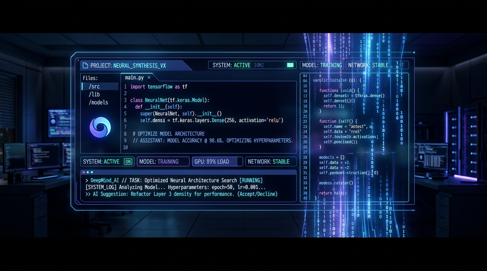
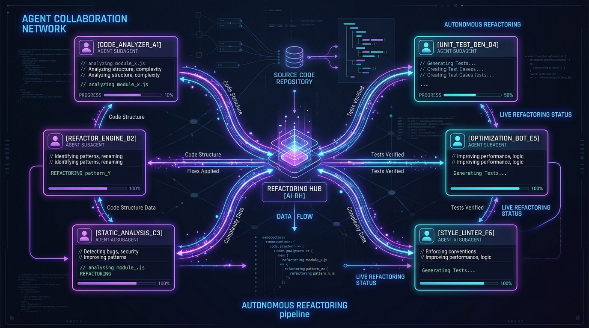

# 🚀 Google Antigravity CLI (agy) — Landing Page Demonstrativa

> **Landing page responsiva, animada e de alta fidelidade desenvolvida para demonstrar todo o ecossistema e capacidades do Antigravity CLI da Google DeepMind.**

[](https://github.com/Psychovv/antigravity_test)
[](https://antigravity.google)
[](#-como-executar-localmente)

---

## 📸 Prévia da Interface



---

## ✨ O que é o Antigravity CLI (`agy`)?

O **Google Antigravity CLI** é uma plataforma de desenvolvimento assistida por IA de próxima geração focada em **desenvolvimento agentizado e autônomo**. Em vez de simples respostas de texto em um chat, o Antigravity CLI permite que desenvolvedores deleguem tarefas complexas para **subagentes autônomos**, executem **processos em segundo plano** sem bloquear o terminal e estendam o sistema com **Model Context Protocol (MCP)** e **Skills personalizadas**.

---

## 🛠️ Recursos Apresentados na Landing Page

### 1. 🤖 Orquestração de Subagentes Autônomos
- Delegação de tarefas para subagentes especializados (`research`, `self`, ou customizados).
- Suporte a workspaces isolados em modo `branch` ou compartilhados em `share`.
- Comunicação direta entre agentes via `send_message` e supervisão com `manage_subagents`.



### 2. ⚡ Execução Assíncrona & Tasks em Background
- Comandos longos executados em background sem travar a linha de comando (`run_command`).
- Notificação reativa automática ao concluir processos.

### 3. ⏱️ Agendador de Tarefas & Cronjobs (`schedule`)
- Definição de timers temporizados ou tarefas recorrentes usando sintaxe cron padrão (ex: `*/5 * * * *`).
- Cancelamento dinâmico baseado em mensagens de resposta.

### 4. 💬 Comandos Slash Nativos
- `/goal` — Missões estendidas autônomas até a conclusão completa da meta.
- `/plan` — Planejamento de etapas antes de modificar o código-fonte.
- `/grill-me` — Entrevista interativa para resolver ambiguidades arquiteturais.
- `/teamwork-preview` — Simulação visual de múltiplos agentes trabalhando em equipe.
- `/schedule` — Interface de agendamento rápido de cronjobs.
- `/learn` — Persistência de regras e preferências de código do usuário.

### 5. 🔌 Ecossistema de Customização (`.agents/`)
- **Skills** (`SKILL.md`): Instruções com YAML frontmatter, scripts e recursos.
- **Rules** (`rules/`): Diretrizes inflexíveis de código e segurança.
- **Plugins**: Bundles reutilizáveis e namespaced.
- **MCP Servers** (`mcp_config.json`): Integração nativa via Model Context Protocol.

---

## 📁 Estrutura de Arquivos do Projeto

```text
antigravity_test/
├── assets/
│   ├── hero_banner.jpg             # Imagem conceitual da interface do CLI
│   └── subagent_orchestration.jpg  # Diagrama de rede de subagentes
├── index.html                      # Estrutura HTML5 semântica e acessível
├── styles.css                      # Design System Dark Theme (Glassmorphism + Animações)
├── script.js                       # Lógica interativa (Abas do terminal, Copy, Drawer mobile)
├── .gitignore                      # Configuração de arquivos ignorados no Git
└── README.md                       # Documentação oficial do repositório
```

---

## 🚀 Como Executar Localmente

### Usando Python:
```bash
python3 -m http.server 8080
```
Abra o navegador em: `http://localhost:8080`

### Usando Node.js / npx:
```bash
npx serve .
```

---

## 🌐 Repositório no GitHub

O código está sincronizado e pode ser acessado no GitHub:
🔗 [https://github.com/Psychovv/antigravity_test](https://github.com/Psychovv/antigravity_test)

---

<p align="center">
  Criado para demonstrar todo o potencial do <strong>Google Antigravity CLI</strong> 🚀
</p>
